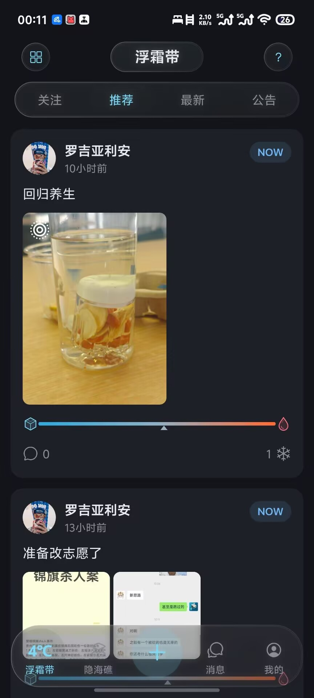
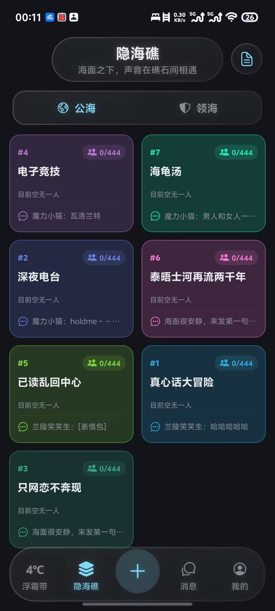
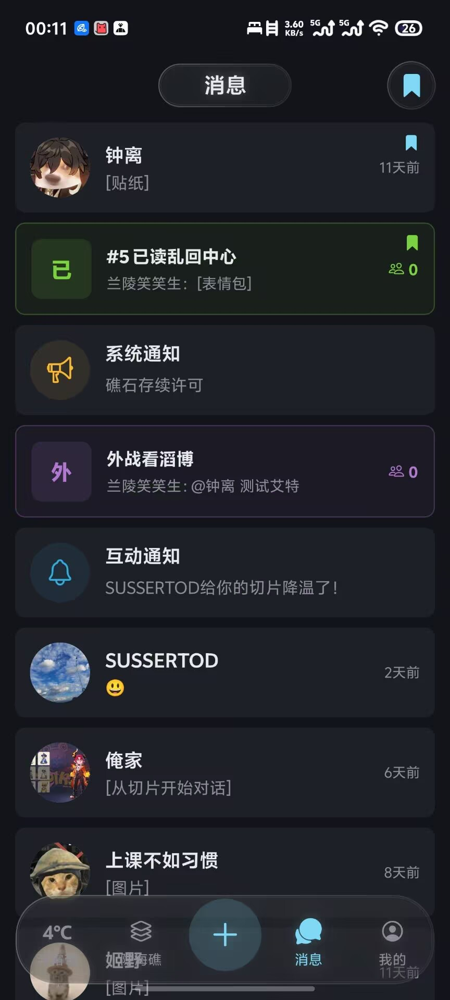
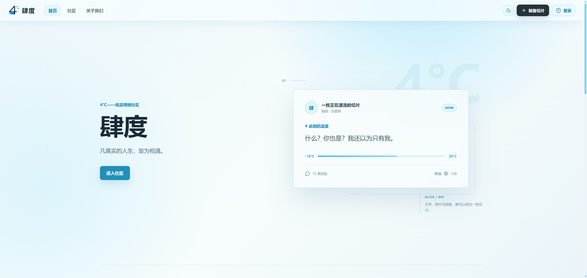
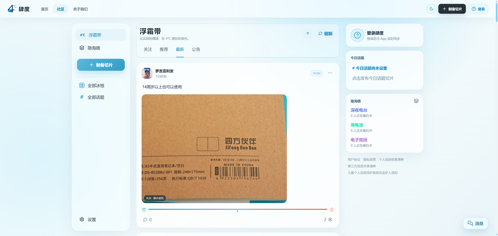

# 4du-FourCelsius

肆度（Four Celsius）是一个开源社区项目，包含 Expo/React Native App、React 网页端和 Node.js 服务端。项目用于学习、研究和自托管部署。

## APP 端

以下截图展示项目真实部署后的移动端主要页面与视觉风格。

<p style="white-space: nowrap;">
  
  
  
  
</p>

## 网页端

以下截图展示项目真实部署后的网页首页与社区页面。

<p>
  
  
</p>

## 项目特点

- **多端同步**：APP 端与网页端共用同一套账号、内容和消息数据，并通过 WebSocket 实时更新。
- **内容社区**：支持发布切片、图片与实况照片，以及冰格、话题、评论、点赞、降温和关注等互动。
- **即时交流**：提供私信、隐海礁群聊、消息收藏、用户提醒和系统通知。
- **个性表达**：包含个人主页、个性标签、资料背景、关注关系和航行日志成就系统。
- **社区治理**：内置举报、申诉、内容审核、用户处罚、操作记录和独立管理后台。
- **本地优先**：无需云服务器即可完整运行，账号、社区数据和上传文件均可保存在本地电脑。
- **易于扩展**：前后端分离，可按需要接入 HTTPS、对象存储、短信验证和第三方内容审核服务。

## 目录

- `community-app/`：Android/iOS 客户端（Expo + React Native）
- `community-web/`：浏览器客户端（Vite + React）
- `server/`：REST API、WebSocket、SQLite 数据库和管理接口

## 部署教程

### 方式一：AI 辅助部署

可以把本仓库地址和下面这段话交给你信任的 AI 编程助手：

```text
请阅读本仓库 README.md 和 DEPLOYMENT.md，在当前电脑上按本地部署方式安装依赖、创建 .env、启动 server 和 community-web，并逐项检查 /api/health。不要读取、输出或提交任何密钥；遇到环境差异时先解释原因再继续。
```

AI 可以协助执行命令和排查日志，但不会替你获得云账号、域名、COS 密钥或短信资质。生产部署前仍需人工检查 `.env`、防火墙、HTTPS 和备份策略。

### 方式二：本地部署（学习和局域网测试）

需要 Git、Node.js 22 LTS（22.13 或更高的 22.x）和 npm。仓库统一使用 npm；不要混用 pnpm/yarn，也不要使用 Node.js 24。

所有数据都可以留在本机，不需要云服务器、COS、域名或短信服务：

- 用户、切片、评论、消息等结构化数据：`server/src/data/sidu.db`
- 用户上传的头像、图片和实况照片：`server/uploads/`
- 本地配置和密钥：`server/.env`（已被 Git 忽略）

第一步，启动服务端：

```powershell
git clone https://github.com/lvguicheniii/4du-FourCelsius.git
cd 4du-FourCelsius/server
Copy-Item .env.example .env
npm install
npm run dev
```

首次启动会自动创建 SQLite 数据库。管理后台地址是 `http://localhost:3001/admin/`，默认账号和密码均为 `noesis`。注册时填写任意格式正确且未使用的 11 位手机号，点击“填入验证码”会自动填写固定验证码 `252616`。

> **重要：** `noesis / noesis` 仅用于本机或隔离局域网测试。首次登录后，请进入管理后台左侧的“管理人员”，在“当前账户设置”中修改登录 ID 和密码（新密码至少 12 位）。如需修改注册固定码，请同时修改 `server/.env` 的 `ACCOUNT_FIXED_CODE` 和 `community-web/.env` 的 `VITE_FIXED_VERIFICATION_CODE`。

第二步，另开终端启动网页端：

```powershell
cd community-web
Copy-Item .env.example .env
npm install
npm run dev
```

网页地址通常是 `http://localhost:5173/community/`（端口被占用时以终端显示为准）。执行 `Invoke-WebRequest http://localhost:3001/api/health`，返回 200 即表示服务端正常。

第三步，用手机预览 App：

1. 安装最新版 [Expo Go](https://expo.dev/go)（[Android 安装说明](https://docs.expo.dev/get-started/set-up-your-environment/)；iOS 从 App Store 搜索 Expo Go）。Expo Go 必须支持本项目的 Expo SDK 57。
2. 手机和电脑连接同一 Wi-Fi；Windows 防火墙需允许 Node.js 访问专用网络。
3. 在新终端执行：

```powershell
cd 4du-FourCelsius/community-app
Copy-Item .env.example .env
npm install
$env:APP_VARIANT='development'
npx expo start --go --lan --clear
```

用 Expo Go 扫描二维码即可。App 会自动使用 Metro 公布的电脑局域网地址连接 `3001` 端口，无需手填 IP；开发预览也会自动关闭生产 OTA 和 React Compiler。

如果使用 Android 模拟器，Metro 通常会自动提供 `10.0.2.2`。若网络结构特殊，可在 `community-app/.env` 中手动设置 `EXPO_PUBLIC_API_URL=http://电脑局域网IP:3001`，然后重启 Metro。出现 Expo Go 启动错误时，先更新 Expo Go，再执行 `npx expo-doctor@latest`；本项目正常结果应为全部检查通过。

停止服务不会清除数据。备份时先停止服务端，再同时复制 `server/src/data/sidu.db` 和整个 `server/uploads/`；恢复时放回原位置。只备份数据库而不备份 `uploads/`，媒体记录会存在但文件会丢失。

本地 HTTP 仅适合学习和局域网测试，不适合直接对公网提供服务。

### 方式三：云服务器部署（公网或生产环境）

准备 Ubuntu 22.04/24.04、Node.js 22 LTS、SQLite、Nginx 和 HTTPS 域名：

```bash
git clone https://github.com/lvguicheniii/4du-FourCelsius.git
cd 4du-FourCelsius/server
cp .env.example .env
npm ci --omit=dev
npm start
```

编辑 `.env`：设置随机 `JWT_SECRET`、`ADMIN_JWT_SECRET`，将 `ADMIN_BOOTSTRAP_USERNAME` 和 `ADMIN_BOOTSTRAP_PASSWORD` 改为自定义管理员账号及至少 12 位的强密码，成功创建后移除 `ADMIN_BOOTSTRAP_*`；生产模式会拒绝默认的 `noesis / noesis`。同时关闭固定验证码、配置 `CORS_ORIGINS`，并通过 Nginx 提供 HTTPS。网页端和 App 的 API 地址必须使用 HTTPS，COS、推送、审核、备份等密钥只放在服务器环境变量中。

完整的 Nginx、进程守护、数据库备份和 App 构建说明请阅读 [`DEPLOYMENT.md`](./DEPLOYMENT.md)。

## 许可

本项目按 MIT License 发布，详见 [`LICENSE`](./LICENSE)。部署者需自行遵守所在地区的法律法规、隐私和内容治理要求。
